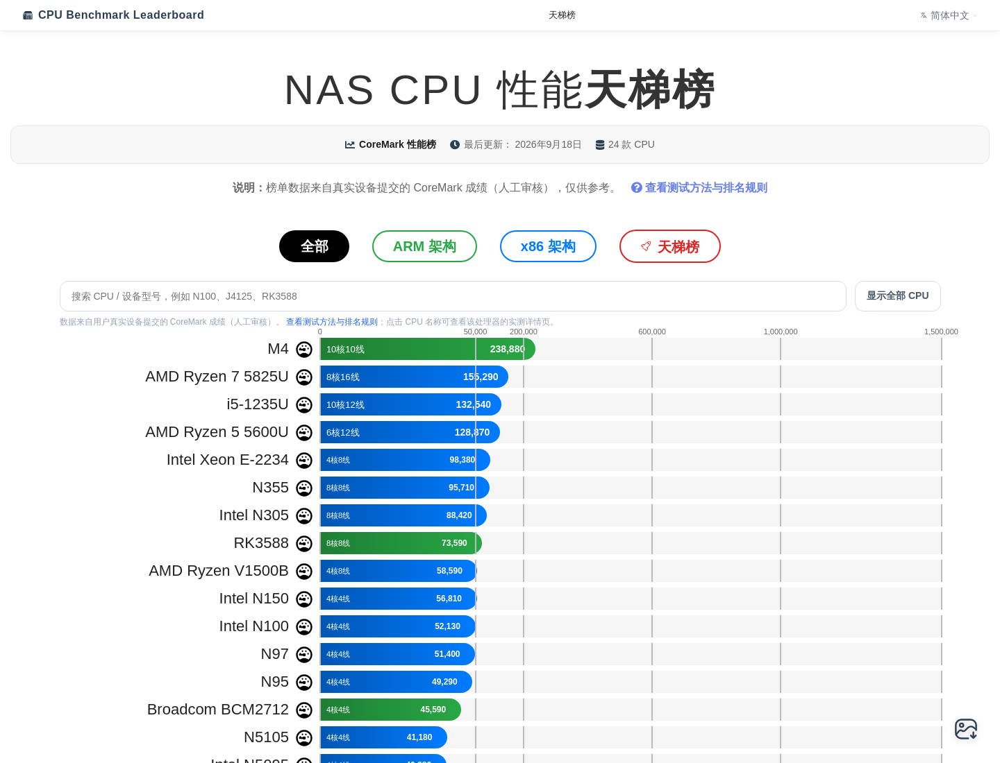
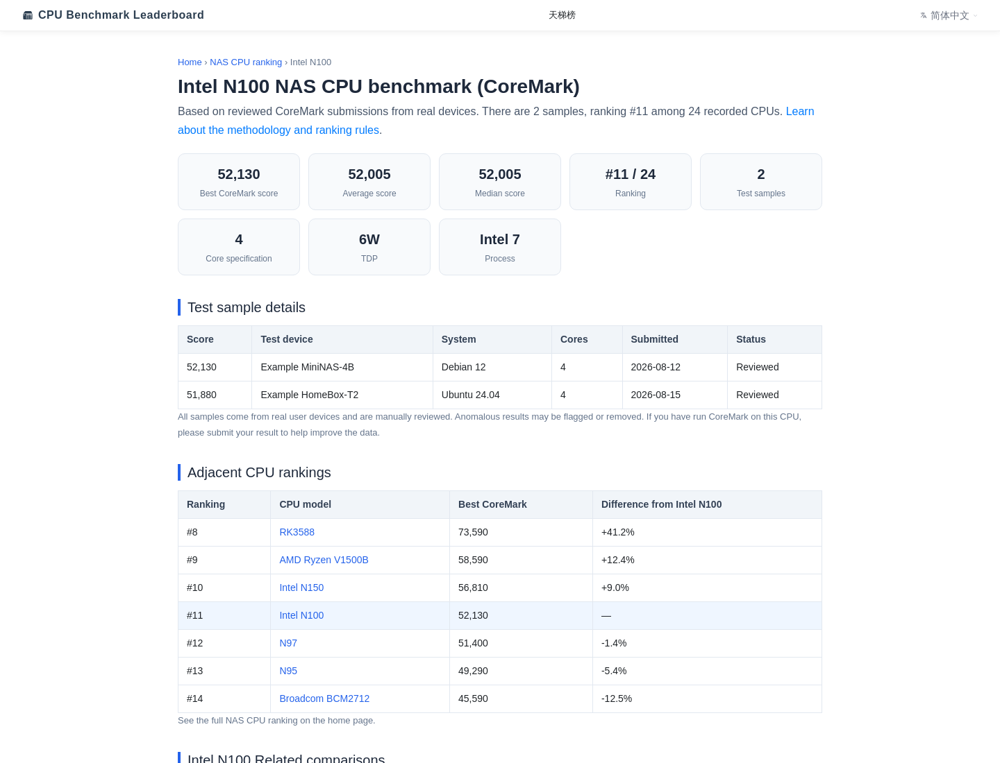
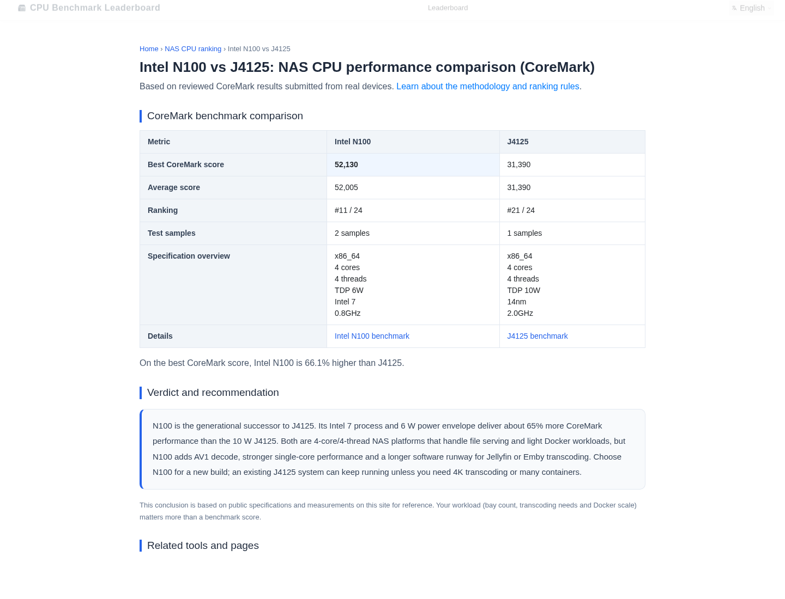

# CPU Benchmark Leaderboard

> 自托管的 CPU 性能天梯榜 —— PHP 8.1 + MariaDB，服务端渲染，零框架依赖。

[](LICENSE)
[](https://www.php.net/)
[](https://mariadb.org/)

按架构浏览、筛选、对比 CPU 跑分：`x86_64` / `ARM64` / `ARMv7` / `Other`。

> ⚠️ **本仓库自带的是虚构示例数据**（`sql/seed.sql`：24 个 CPU 型号 + 25 条跑分样本），仅用于演示界面。
> 真实数据来自用户在本站运行 CoreMark 后提交的跑分（提交链路不含在本仓库内）。

> 由 [17nas.com](https://17nas.com/) 开源 —— 一个 NAS 与网络工具站。

## Screenshots

| 天梯榜 | CPU 详情页 | CPU 对比页 |
|---|---|---|
|  |  |  |
*截图均为虚构示例数据*

---

## Features

- CPU 天梯榜主视图（SSR），按架构筛选：全部 / ARM / x86，另有左右对照式天梯图视图
- CPU 详情页 `/cpu/{slug}`：最佳/平均/中位跑分、排名、相邻排名、测试样本表
- CPU 对比页 `/cpu/{a}-vs-{b}`：人工撰写的精选对比（`includes/cpu-compare-pairs.php`）
- 天梯图一键导出 PNG/JPEG（html2canvas 本地打包）
- 多语言：zh-CN 默认，en-US 覆盖（`lang/` 扁平语言文件 + `?lang=` 切换）
- SEO：canonical / hreflang / JSON-LD，服务端渲染对搜索引擎友好

## Quick start（Docker，一条命令）

```bash
docker compose up -d --build
# 打开 http://localhost:8080
```

compose 起 `php:8.1-apache` + `mariadb:10.6`，自动导入 `sql/schema.sql` + 示例数据 `sql/seed.sql`。

## 手动部署

```bash
# 1. 建库导数据
mysql -u root -p -e "CREATE DATABASE leaderboard CHARACTER SET utf8mb4"
mysql -u root -p leaderboard < sql/schema.sql
mysql -u root -p leaderboard < sql/seed.sql

# 2. 写运行配置（非 example 的 config/*.php 已被 gitignore）
cp config/database.example.php config/database.php
cp config/site.example.php config/site.php   # 改 site_url / site_name

# ⚠️ 首页「一键跑分」命令默认指向 /coremark/run.sh（本仓库未附带该脚本）。
#    必须替换为你自己托管的 CoreMark 运行脚本：在 config/site.php 里设
#    'coremark_script_url' => 'https://your-domain.example/coremark/run.sh'
#    （脚本内容：下载对应架构的 CoreMark 二进制并输出总分，可自行编写或
#     用官方 EEMBC CoreMark 源码构建，见 https://www.eembc.org/coremark/）。

# 3. Web 根指向仓库根目录；启用 rewrite 后 /cpu/{slug}、/cpu/{a}-vs-{b} 生效
#    Apache: 已附 .htaccess（需 AllowOverride All + mod_rewrite）
#    Nginx: 参照下方 location 示例
```

Nginx 示例：

```nginx
location ~ ^/cpu/([a-z0-9-]+)-vs-([a-z0-9-]+)$ {
    try_files $uri $uri/ /cpu-compare.php?a=$1&b=$2;
}
location ~ ^/cpu/([a-z0-9-]+)$ {
    try_files $uri $uri/ /cpu-detail.php?slug=$1;
}
```

或直接带参数访问：`/cpu-detail.php?slug=intel-n100`、`/cpu-compare.php?a=intel-n100&b=j4125`。

## Architecture

```
index.php                    天梯榜首页（SSR + JS 交互）
cpu-detail.php               CPU 实体页 /cpu/{slug}
cpu-compare.php              CPU 对比页 /cpu/{a}-vs-{b}
benchmark-methodology.php    测试方法页
api/get_benchmarks.php       榜单 JSON（仅公开字段）
api/get_ranking_data.php     天梯图左右对照 JSON
api/public/benchmark-detail.php  CPU 实测详情 JSON（仅公开字段）
includes/                    页面片段、i18n、DB、SSR 行/卡渲染、白名单/对比对
config/*.example.php         配置模板（复制为 config/*.php 使用）
lang/                        扁平语言文件（zh-CN 全量，其他语言覆盖）
sql/                         建表（隐私脱敏）+ 示例数据
assets/css|js                前端资源（html2canvas 本地打包，MIT）
```

## Architecture (stack)

| 层 | 技术 |
|---|---|
| 后端 | PHP 8.1（无框架） |
| 数据库 | MariaDB 10.6 |
| 前端 | 原生 JS + html2canvas（本地打包） |
| 渲染 | PHP 服务端渲染为主 |

## What this project does NOT include

上游应用同时承载了用户体系与商业功能。以下内容**有意不包含**在本仓库：

- 注册 / 登录 / 会话 / 验证码
- 会员与定价逻辑
- 支付与订单
- 后台管理端
- **用户提交的原始跑分记录及任何可关联到个人的信息**（邮箱/IP/用户ID/昵称/头像/截图/审核备注——`benchmark_submissions` 开源版表结构已删除这些列）
- 跑分提交功能（上游写隐私字段，v1 不含；`status` 列保留以便后续自建审核流）
- 任何真实密钥或凭据
- 部署与运维脚本、Web 服务器配置

本仓库只包含**排行与展示**这一层。详见 [docs/SPEC.md](docs/SPEC.md)。


## Contributing

欢迎 issue 与 PR。提交前请先读 [docs/SPEC.md](docs/SPEC.md) 的边界说明。

## 相关项目

- [**llm-leaderboard-data**](https://github.com/AmigaMeow/llm-leaderboard-data) —— 每日自动更新的大模型排行榜数据
- [**llm-benchmark-leaderboard**](https://github.com/AmigaMeow/llm-benchmark-leaderboard) —— 自托管的大模型排行榜程序

## License

[MIT](LICENSE) © 2026 17nas.com
